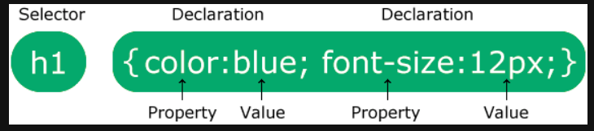

# Bsics 
CSS stands for Cascading Style Sheets
CSS describes how HTML elements are to be displayed on screen, paper, or in other media
CSS saves a lot of work. It can control the layout of multiple web pages all at once
External stylesheets are stored in CSS files

# Css structure
* A CSS rule consists of a selector and a declaration block.



* The selector points to the HTML element you want to style.
* The declaration block contains one or more declarations separated by semicolons.
* Each declaration includes a CSS property name and a value, separated by a colon.
* Multiple CSS declarations are separated with semicolons, and declaration blocks are surrounded by curly braces.

# How to include css file in html?

* in head tag: 
```html
<link rel="stylesheet" href="style.css">
```


# Css classes

* use 

