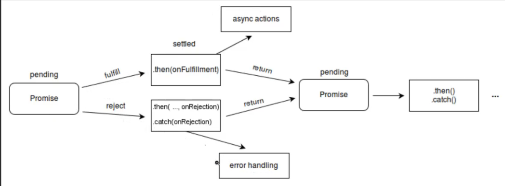

# Promise

* A JavaScript Promise object contains both the producing code and calls to the consuming code:


* **"I Promise a Result!"**

"Producing code" is code that can take some time

"Consuming code" is code that must wait for the result

A Promise is a JavaScript object that links producing code and consuming code

**Parameters:**


```javascript
let myPromise = new Promise(function(myResolve, myReject) {
// "Producing Code" (May take some time)

  // Define sucess and failure
  if ( /* successful condition */ ) {
    myResolve(); // when successful
  } else {
    myReject();  // when error
  }
  
});

// "Consuming Code" (Must wait for a fulfilled Promise)
myPromise.then(
  function(value) { /* code if successful */ },
  function(error) { /* code if some error */ }
);
```


* Used for asynchronous computations.
* fetch() returns a promise. Should wait for the promise to resolve before
  continuing.
* The Promise object represents the eventual completion (or failure) of an
  asynchronous operation and its resulting value.



Promise states: 

## Promise states
JavaScript Promise object can be:
* Pending - initial state, neither fulfilled nor rejected
* Fulfilled
* Rejected


The Promise object supports two properties: state and result.
* While a Promise object is "pending" (working), the result is undefined.
* When a Promise object is "fulfilled", the result is a value.
* When a Promise object is "rejected", the result is an error object.


# Create a Promise

* Use `new Promise()`  to create a promise
* Parameters: a callback function with two parameters: `resolve` and `reject`


# How to use 
* Promise.then() takes two arguments, a callback for success and another for failure.
* Both are optional, so you can add a callback for success or failure only.
* 
```javascript
myPromise.then(
  function(value) { /* code if successful */ },
  function(error) { /* code if some error */ }
);
```


# .then() and .catch()
* `.then()`  - takes a callback function
* is sutable for single promise - if nested, it will be a callback hell - use async/await instead 
* XXX: clearify 

# async/await
* await is only avlid inside async function
* need async keyword to create async function
* async function is same as usual function but can use await inside it and it
  will wait for promise to resolve.


```javascript
async function myAsyncFunction() {
    await myPromise
}
```

## How to solve callback hell

### Example with async/await
* Solution to callbakc hell: 
```javascript
async function myFunction() {
    console.log("first)
    await setTimoutPromise(1500)
    console.log("second)
    await setTimoutPromise(1500)
    console.log("third)
    await setTimoutPromise(1500)
}
```

### Example with .then()
* Callback hell example: 
```javascript
function myFunction() {
    console.log("first)
    setTimoutPromise(1500).then(() => {
        console.log("second)
        setTimoutPromise(1500).then(() => {
            console.log("third)
        })
    })
}
```

# .then() vs async await
Should i use .then or only async await?
* use both. 
* use async await for single promise
* use .then for multiple promises - to avoid callback hell


# Why Promise
* Essentially, a promise is a returned object to which you attach callbacks,
  instead of passing callbacks into a function.


